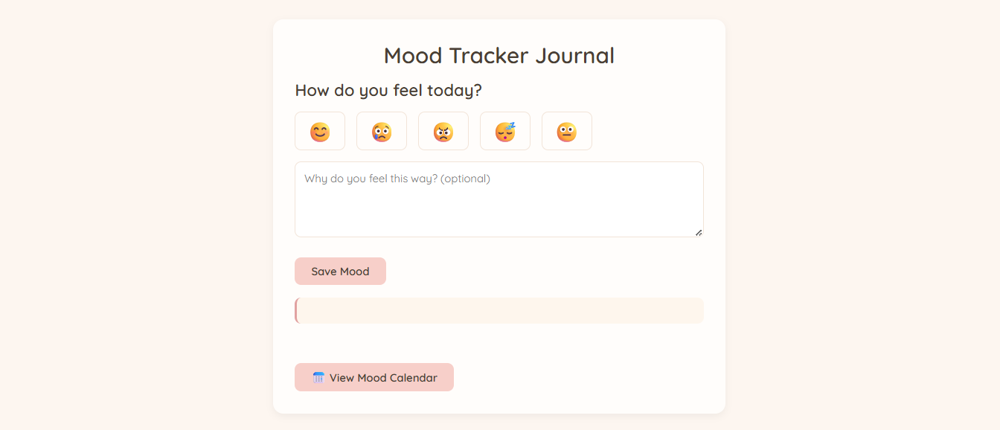

# 🌸 Mood Tracker Journal 🌸

A simple and minimalist web app to track your daily moods using emojis, journal entries, and an interactive calendar. Built with HTML, CSS, and JavaScript.




## ✨ Features ✨

- Emoji-based mood selection (😊happy 😢sad 😠angry 😴tired 😐normal)
- Optional journal input for each mood where user can reflect their feelings 
- Quotes that match your mood, to uplifting, encouraging, etc.)
- Mood history displayed in a simple calendar view to visualization of emotional patterns over time
- Responsive for desktop and mobile (optimized for desktop-only)
- Clean & soft UI with a beige color palette to keep it simple and pleasing

## 🎯 Purpose 🎯

This project was created as a final showcase for the **Hacktiv8 Capstone Porject for Code Generations and Optimization Online Course**. Demonstrate real outcomes from learning journey, particularly in web development, enhanced by AI tools such as IBM Granite.

## 🛠️ Technologies 🛠️

- IBM Granite 3.3-8b-instruct from Replicate 
- HTML5
- CSS3
- JavaScript (Vanilla)

## 📦 How to Use 📦

1. Clone or download this repository
2. Open `index.html` in your browser (no installation required)
3. All data is stored in browser memory (local only)

- This project is live at:
👉 https://styfie.github.io/Mood-Tracker-Journal/

## 💖 Credits 💖
Made with love by @styfie
For educational and portfolio purposes only

```bash
git clone https://github.com/styfie/Mood-Tracker-Journal.git
cd Mood-Tracker-Journal
# Then open index.html in your browser
